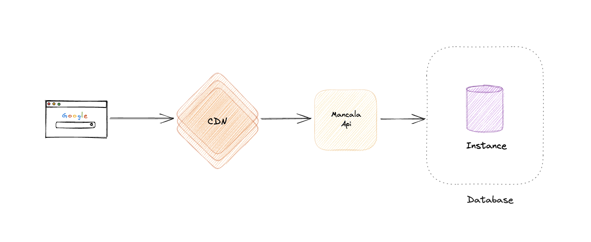
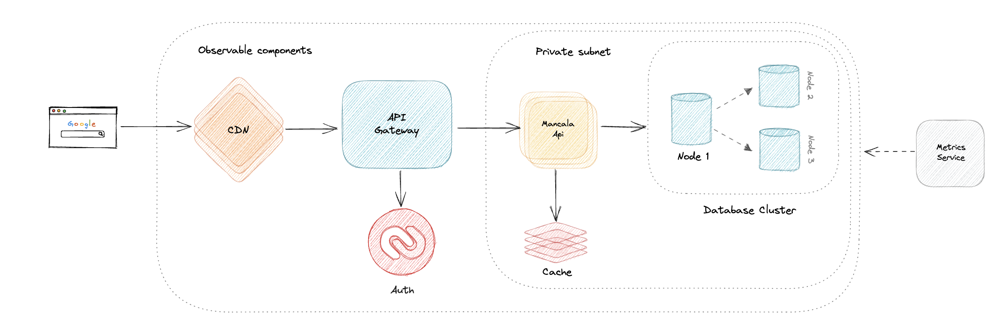

# Mancala
Mancala refers to a family of two-player turn-based strategy board games played with small
stones, beans, or seeds and rows of holes or pits in the earth, a board or other playing surface. The objective is
usually to capture all or some set of the opponent's pieces.

## Rules
#### Game Play
The player who begins with the first move picks up all the stones in any of his own six pits, and sows the stones on to
the right, one in each of the following pits, including his own big pit. No stones are put in the opponents' big pit.
If the player's last stone lands in his own big pit, he gets another turn. This can be repeated several times before
it's the other player's turn.

#### Capturing Stones
During the game the pits are emptied on both sides. Always when the last stone lands in an own empty pit, the player
captures his own stone and all stones in the opposite pit (the other player’s pit) and puts them in his own
(big or little?) pit.

#### The Game Ends
The game is over as soon as one of the sides runs out of stones. The player who still has stones in his pits keeps
them and puts them in his big pit. The winner of the game is the player who has the most stones in his big pit.

---

### Architecture


The application follows clean architecture, all processes flow from outside to inside: presenter to application,
and application to domain. The application was split in 4 different layers:
1. **Presentation**: Handles data input and output, in this case only http inputs
2. **Application**: Handles process logics, orchestrates the process through the domain.
3. **Domain**: Handles business logic by controlling how entities state should change and how these entities
   are stored through interfaces
4. **Infrastructure**: Implements domain interfaces and might offer connection to external applications or services.

### System Design
A reasonable initial design for this application would be simply having a single instance of the service exposed by
public dns, being reachable by anyone in the internet, it does not require horizontal scaling nor any high load
database strategies:


Once the application starts having a higher load, then different components can get introduced:
- First is an api-gateway that will put an interface between clients and the service, this will make easier to scale
and apply different reading/writing strategies;
- Assuming the service will have to deal with higher level of writing operations without transactional consistency,
a possible setup would be introducing a nosql cluster
- An authentication system so players history could be stored, as well as multiplayer functionalities
- Additionally, there is a caching component that could store current game state reducing the load on reading the
database. The cache could have a short TTL since the game would start and finish very quickly, but having the game
stored in a database would allow the application to provide a game historical data, score board and friends competition
functionalities



### Decisions made:
1. In Memory Database: Since the task intention was to evaluate mostly the ability to solve the problem, there was no
   need to setup any database, migrations and ORMs, the task could be completed by simply using an in memory repository
2. [Micronaut](https://micronaut.io/) was chosen as a framework, even though there was no major reason behind this choice.
   Micronaut was very easy to configure and run an application from scratch, a rest api is exposed out of the box
   and there is a very first endpoint and test set, which help moving forward. Extending its configuration is also
   very easy, and its documentation is well written and up to date, additionally, there were examples for all
   functionalities needed to complete the scheduler service.
3. No authentication was implemented: implementing any auth system would require much more development that was not
   the requirement, even thought would be necessary in a production environment the task didn't require it to get
   completed.

### Further Improvements
1. User management: Having an auth mechanism would allow the app to provide many other different functionalities,
   such as leaderboard or multiplayer matches. 
2. Database to store the current game state: there is no need to relational data at least to store matches state,
   however a nosql database would fit perfect for this purpose, any customer related data could be stored in a sql
   database since it would offer relational consistency and make it easier to deal with data protection.
3. Board configuration: The game offers only a hard coded configuration, however it could offer customization for
   the number of pits as well as stones per pit, also, there are many variations of the game and a few of them
   could also be configured.

## Running the application
```shell
# for simplicity the application and its frontend were already build,
# running `make up` command should expose the app in the 8080 port
# and the frontend will also be served. `make up` command also outputs
# logs but does not attach docker container, that means that when output
# is canceled the app remain running 
make up 

# to stop the app you might stop logs (ctrl+c on macos) and run `make down` command
make down # stop the application

# in case logs output was canceled, `make logs` command will show it again 
make logs # ctrl+x will close the logging follower, this command will show docker logs again 
```
Once the app is up and running, just visit its home page, probably [http://localhost:8080](http://localhost:8080) 

### Running tests
Tests might be run by the makefile or the gradle wrapper.

```shell
make test
./gradlew test
```

### Re-building the application
There is no need to rebuild the app, however it can be done with `make configure` command
```shell
make configure
```

## Micronaut 4.1.2 Documentation

- [User Guide](https://docs.micronaut.io/4.1.2/guide/index.html)
- [API Reference](https://docs.micronaut.io/4.1.2/api/index.html)
- [Configuration Reference](https://docs.micronaut.io/4.1.2/guide/configurationreference.html)
- [Micronaut Guides](https://guides.micronaut.io/index.html)
---

- [Micronaut Gradle Plugin documentation](https://micronaut-projects.github.io/micronaut-gradle-plugin/latest/)
- [GraalVM Gradle Plugin documentation](https://graalvm.github.io/native-build-tools/latest/gradle-plugin.html)
- [Shadow Gradle Plugin](https://plugins.gradle.org/plugin/com.github.johnrengelman.shadow)
## Feature serialization-jackson documentation

- [Micronaut Serialization Jackson Core documentation](https://micronaut-projects.github.io/micronaut-serialization/latest/guide/)

## Feature micronaut-aot documentation

- [Micronaut AOT documentation](https://micronaut-projects.github.io/micronaut-aot/latest/guide/)
